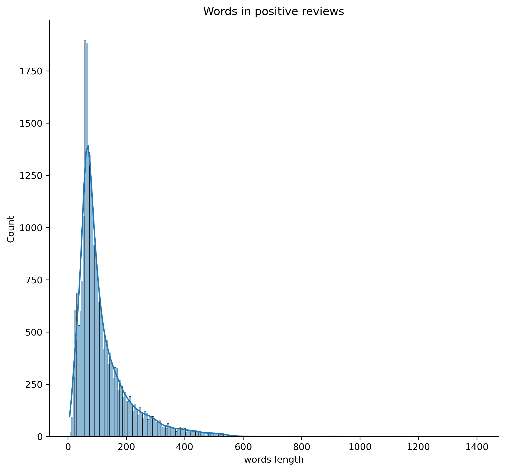
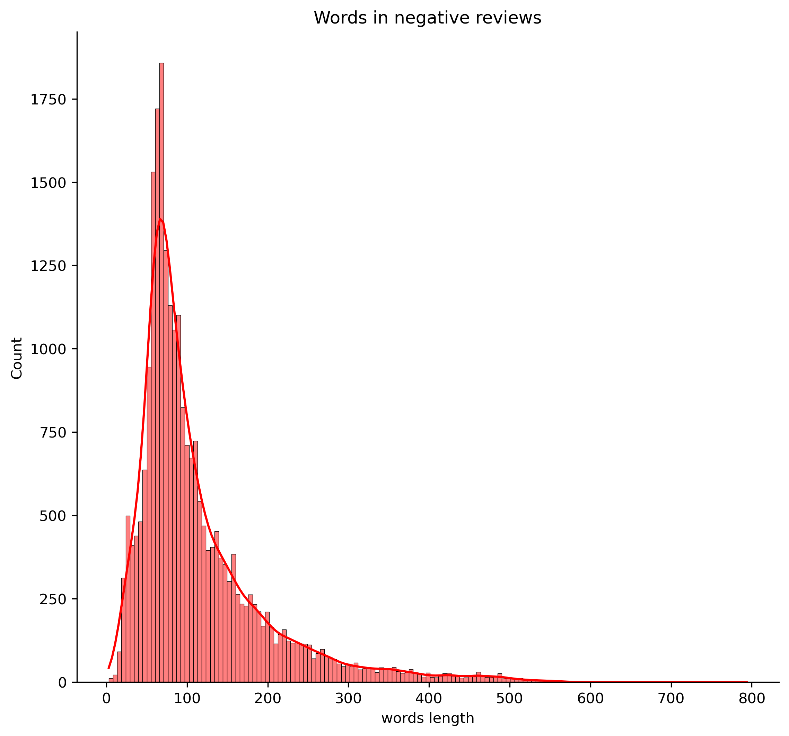
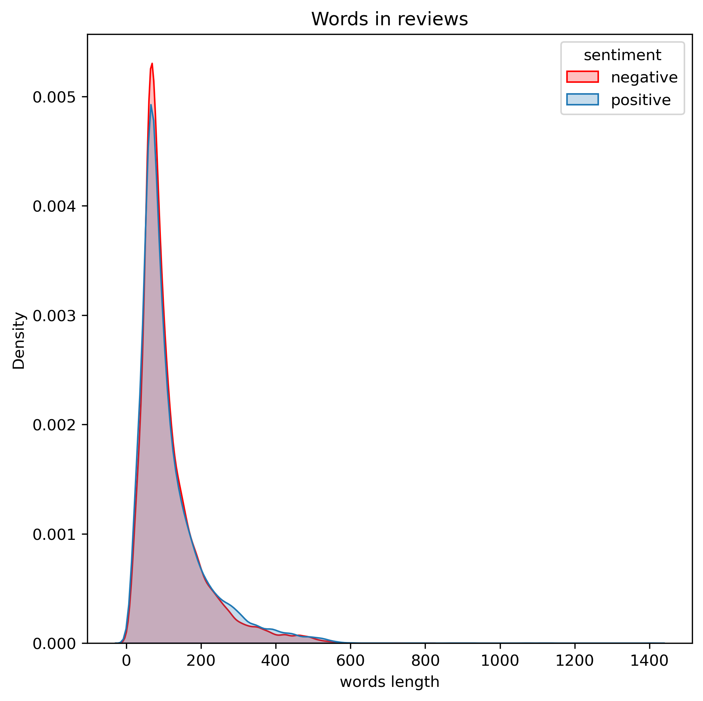

# Sentiment-Analysis-Project
In this exercise, we will practice analyzing customer sentiment based on movie review comments, using typical text classification approaches. The classification task is illustrated in the image below. Each text unit will be classified with a specific label from a given set of labels.
# Text Preprocessing Including
|Step | Step 1 | Representation |
| ---------|----------|----------|
|   1| Remove HTML tags   | `soup = BeautifulSoup(text, "html.parser")`<br> `text = soup.get_text()`|
|   2| Expand contractions   | `text = expand_contractions(text)` |
|   3| Remove emoji   |  `emoji_clean = re.compile("["` <br> `u"\U0001F600-\U0001F64F"` <br> `u"\U0001F300-\U0001F5FF" `<br> `  # symbols & pictographs` <br> `u"\U0001F680-\U0001F6FF"  # transport & map symbols` <br> `u"\U0001F1E0-\U0001F1FF"  # flags (iOS)` <br > `u"\U00002702-\U000027B0"` <br> `u"\U000024C2-\U0001F251"` <br> `"]+", flags=re.UNICODE)` <br>`text = emoji_clean.sub(r'', text)`  |
|   4| Remove URLs   |`text = re.sub(r'http\S+', '', text)`|
|   5| Remove punctuation and lowercase the text  | `text = text.translate(str.maketrans('', '', string.punctuation)).lower()`  |
|   6|  Lemmatize and remove stopwords  |` text = " ".join([wl.lemmatize(word) for word in text.split() if word not in stop and word.isalpha()])` |

# Modeling
|Step | Step 1 | Representation |
| ---------|----------|----------|
|   1| Decision Tree|  `accuracy`   |
|   2| Random Foreset|  `accuracy`    |
|   3| AdaBoosting |  `accuracy`    |
|   4| Gradient Boosting|  `accuracy`   |
|   5| XGBooost|  `accuracy`   |

# How to run
1. ```git clone https://github.com/VayneMai020301/Sentiment-Analysis-Project.git```
2. ```python main.py```

# Visualization 
<div style="display: flex; justify-content: space-around;">
    
    
    
</div>
